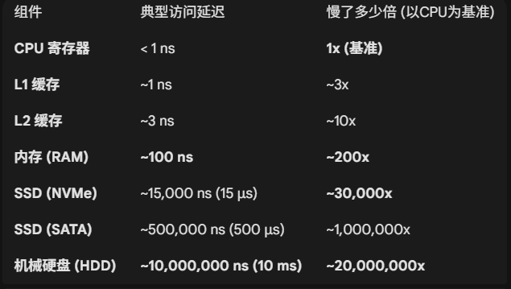
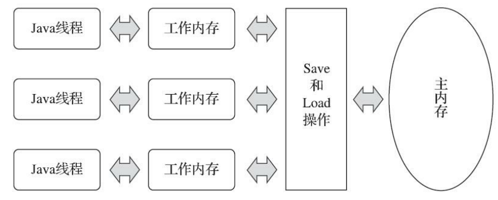

## 引言

“在摩尔定律逐渐失效的今天，多线程并发编程已不再是选修课，而是现代软件工程师的必修课。单核 CPU 的时代早已成为历史的尘埃，如今即便是入门级的云服务器，‘2C2G’也已成为标配。

硬件架构的并行化，叠加移动互联网时代流量的爆发式增长，对服务端程序的性能提出了严苛挑战。如何压榨多核 CPU 的算力以应对海量高并发请求，已成为决定系统生死的关键命门。”

服务端是**Java**最擅长的领域之一，但如何写好高并发的应用程序又是一大难题 得益于Java语言和虚拟机提供的诸多机制 导致并发编程的门槛降低了不少 但无论其中的框架多么先进 **了解其中的内幕依然是从初级进阶的必经之路**

（此篇文章参考了我最喜欢的一本书《深入理解JVM虚拟机：JVM高级特性与最佳实践》， 非常推荐大家去读）
## 第一部分: 硬件的效率与一致性

我们都知道，相对于磁盘的低速来说 内存是高速的 即使是目前最为流行的SSD硬盘来说，它的速度也是不如内存的， 所以在开发一些服务端的时候 我们通常把热点数据放入内存以实现一个高速读取的效果 就拿作者部署在线上的一个demo来说

我们可以看到在没命中索引的情况下 为200ms左右

而在命中和缓存的时候 为60ms左右 这个数据还会随着数据库的数据增多而进一步的拉大


但是相对的CPU的高速 内存的速度又是显得那么不值一提 以下是CPU 内存 磁盘之间的速度对比


正如前文数据所示，CPU 与内存之间的速度差异是数量级的。为了填平这巨大的鸿沟，现代 CPU 架构引入了多级缓存体系（L1/L2/L3 Cache）。

但正如软件工程中的那句名言：“计算机科学中没有银弹”。引入缓存虽然提升了速度，却带来了棘手的**缓存一致性”问题。这与我们在业务开发中经常遇到的“Redis 缓存与数据库一致性**问题有异曲同工之妙——当多个核心同时持有同一个变量的缓存副本时，如何保证大家看到的数据是一样的？

为了解决这个问题，不同的物理架构（x86, ARM）和操作系统都实现了各自的内存模型和指令规范。但这又带来了新的问题（各种机器的内存模式十分复杂 这里不展开讲了）：

Java是一个支持跨平台的语言 也就是我们常说的一次编译到处运行 所以Java它不能去复用操作系统的内存模型 只能自己去实现一套内存模型 也就是我们今天的主角**JMM** （Java内存模型）

***举个栗子***：
“如果 Java 直接使用底层的硬件模型，那么你写的并发代码可能在 x86 机器上跑得好好的，换到 ARM 服务器（如 Mac M1 或 手机芯片）上就莫名其妙报错了。JMM 的出现，就是为了统一标准，在各种硬件之上建立一层抽象协议。”

## 第二部分: JAVA内存模型

Java内存模型主要定义了程序之间各种变量的访问顺序，我们都知道进程实在内存中运行的，也就是我们使用的变量是存放在内存中的 但 CPU 才是执行计算的大脑

由于 CPU 与内存之间存在巨大的速度差异，现代计算机引入了多级缓存。映射到 JMM 中，这就形成了**主内存与线程工作内存）**的分层架构。

每个线程都有自己独立的工作内存，每次需要把主存中的变量读取到工作内存中.



既然 JMM 抽象出了主内存与工作内存的分层架构，那么一个紧迫的问题随之而来：数据究竟如何在两者之间流转？

比如，线程如何从主内存拉取数据？计算后的结果又是何时刷回主内存的？为了精准定义这些交互细节，JMM 定义了 8 种原子操作。这些操作是不可再分的最小执行单元，它们构成了并发编程内存交互的基石。

> ·lock（锁定）：作用于主内存的变量，它把一个变量标识为一条线程独占的状态。
·unlock（解锁）：作用于主内存的变量，它把一个处于锁定状态的变量释放出来，释放后的变量
才可以被其他线程锁定。
·read（读取）：作用于主内存的变量，它把一个变量的值从主内存传输到线程的工作内存中，以
便随后的load动作使用。
·load（载入）：作用于工作内存的变量，它把read操作从主内存中得到的变量值放入工作内存的
变量副本中。
·use（使用）：作用于工作内存的变量，它把工作内存中一个变量的值传递给执行引擎，每当虚
拟机遇到一个需要使用变量的值的字节码指令时将会执行这个操作。
·assign（赋值）：作用于工作内存的变量，它把一个从执行引擎接收的值赋给工作内存的变量，
每当虚拟机遇到一个给变量赋值的字节码指令时执行这个操作。
·store（存储）：作用于工作内存的变量，它把工作内存中一个变量的值传送到主内存中，以便随
后的write操作使用。
·write（写入）：作用于主内存的变量，它把store操作从工作内存中得到的变量的值放入主内存的
变量中。


这个过程简单来说就是四步走 加锁解锁， 拷贝 运算 刷新   但正是这个‘拷贝-运算-刷新’的过程，引发了后续的并发问题。

还记得我在其他文章中提到的并发编程的三大核心问题吗 ：“**可见性**”， “**有序性**”，“**一致性**”

1. 假设现在有一个线程读到了数据进行了修改，但在它准备写入的时候 又来了一个线程读到了旧的值，一个线程修改了 但另一个线程不可见
   这就是我们常说的**可见性问题**

2. 你可能会理所当然地认为： *“我写在前面的代码，肯定先执行；写在后面的代码，肯定后执行。”*
   但在多核高并发的世界里，这个假设是**不成立**的 ）。

> #### 什么是指令重排序？
>
> 为了提高程序的运行效率，**编译器**和**处理器**往往会对指令序列进行重新排序。也就是说，你写下的代码顺序（程序顺序），并不等于实际执行的顺序（执行顺序）。
>
> 这种重排主要分为以下三种情况：
>
> 1.  **编译器优化的重排序**：
      >
      >     -   编译器（如 JIT）在不改变单线程程序语义的前提下，可以重新安排语句的执行顺序。
>     -   *例子：* 你写 `a = 1; b = 2;`，编译器觉得先算 `b` 能更好地利用寄存器，就改成了 `b = 2; a = 1;`。
>
> 1.  **指令级并行的重排序**：
      >
      >     -   现代 CPU 采用了指令级并行技术（Instruction-Level Parallelism, ILP）来将多条指令重叠执行。如果不存在数据依赖性，CPU 可能会改变机器指令的执行顺序。
>
> 1.  **内存系统的重排序**：
      >
      >     -   由于 CPU 使用了写缓冲区（Store Buffer），使得“写”操作看起来像是“异步”的，这会导致内存操作的执行顺序看起来发生了变化。
>
> #### 为什么单线程没事，多线程会炸？——As-if-serial 语义
>
> 你可能会慌：“乱序执行？那我的代码逻辑岂不是全乱套了？”
>
> 别担心，JMM 保证了**As-if-serial
> 语义**：不管怎么重排序，**单线程**程序的执行结果不能被改变。编译器和处理器在重排序时，会严格遵守**数据依赖性**（比如 `int a
> = 1; int b = a;`，因为 b 依赖 a，所以这两句绝对不会乱序）。
>
> **但是！As-if-serial 只保护单线程，不保护多线程！**

这就是我们的有序性问题 本质上来说 指令重排序可以根据引用关系保证单线程串行执行的语义一致性但是不能保证多线程并发执行的语义一致性

比如说：

```java
class ReorderExample {
    int data = 0;
    boolean inited = false;

    // 线程 A
    public void writer() {
        data = 1;          // 步骤 1：准备数据
        inited = true;     // 步骤 2：标记完成
    }

    // 线程 B
    public void reader() {
        if (inited) {      // 步骤 3：判断标记
            int x = data;  // 步骤 4：使用数据
            System.out.println(x);
        }
    }
}
```


> 1.  线程 A 执行 `writer()`。由于 `data = 1` 和 `inited = true` 之间没有数据依赖，**编译器或 CPU 可能会把它们重排序**。
> 1.  **实际执行顺序**变成了：先执行 `inited = true`，再执行 `data = 1`。
> 1.  就在 `inited` 刚变成 `true`，但 `data` 还没赋值（还是 0）的瞬间，线程 B 抢占了 CPU。
> 1.  线程 B 执行 `reader()`，发现 `inited` 为真，于是读取 `data`。
> 1.  **结果：** 线程 B 读到了 `0`（初始值），而不是预期的 `1`。

这就是有序性问题带来的后果：**代码逻辑在多线程环境下失效了。**
在多线程环境下，如果两个线程之间存在没有同步的数据交互，重排序就可能破坏程序的逻辑

**了解过并发编程的同学可能知道，volatile 关键字能保证变量的可见性，有序性。那么，它是如何做到的呢？**

从 JMM 的角度来看，volatile 的“魔法”主要体现在：

保证可见性：它强制打破了 CPU 缓存的封闭性。每次修改 volatile 变量，JMM 会强制将数据立即刷新回主内存；而其他线程读取该变量时，也被强制从主内存重新加载，确保大家看到的都是最新值。

volatile 关键字还可以保证变量之间的有序性 它是如何保证的呢 这就不得不提到JMM的另一大核心实现了：**内存屏障**

- 首先内存屏障的一个作用就是禁止了指令重排序，这就保证了一致性。


其次我们还可以把内存屏障看作是 CPU 的**强制刷新指令**：

1.  **写屏障 —— 强制刷回**

    -   **时机**：当你在代码中**修改**一个 `volatile` 变量时，JMM 会在写操作之后插入一个写屏障。
    -   **作用**：这个屏障会强制将 CPU 写缓冲区中的数据**立即刷回到主内存**中，而不是停留在 CPU 的私有缓存里。
    -   *白话理解*：就像你写完作业，屏障强迫你立刻把作业交给老师（主存），而不是藏在书包里。

1.  **读屏障 —— 强制失效**

    -   **时机**：当你在代码中**读取**一个 `volatile` 变量时，JMM 会在读操作之前插入一个读屏障（Load Barrier）。
    -   **作用**：这个屏障会强制使 CPU 的**本地工作内存（缓存）失效**。如果缓存失效了，CPU 就被迫去主内存中重新读取最新的值。
    -   *白话理解*：就像考试前（读取变量），屏障强迫你把脑子里记错的旧知识忘掉（缓存失效），必须翻开书本（主存）看最新的标准答案。

正是通过这两道屏障的配合——**写后强制刷回，读前强制刷新**，`volatile` 完美解决了多核 CPU 之间的数据“时差”问题，从而保证了可见性。

那么现在让我们揭开 `volatile` 的神秘面纱吧，它之所以能同时保证**可见性**和**有序性**，其底层的核心魔法正是 **内存屏障 (Memory Barrier)** 。

JMM 通过在 `volatile` 变量读写操作的前后，精准插入特定类型的内存屏障指令。这些屏障就像一道道“关卡”：

1.  **对内（有序性）** ：它是一道**物理栅栏**，严格禁止屏障两侧的指令进行重排序。
1.  **对外（可见性）** ：它是一道**强制同步令**，强迫 CPU 将最新数据刷回主存，或强制让缓存失效从而去主存拉取新数据。

**怎么样 是不是一下就醍醐灌顶了呢？**


讲完了可见性（volatile/MESI）和有序性（内存屏障），我们终于迎来了并发编程中最难啃的骨头——原子性。

首先一个核心的问题：为什么**volatile**不能保证原子性 这也是面试中常见的问题：

> “volatile 既然能保证可见性，那 i++ 是线程安全的吗？” 答案是：否。

什么是原子性？ 简单来说，就是**“要么全做，要么全不做”**。一个操作在执行过程中，不能被其他线程中断或干扰。
而i++ 看起来是一行代码，但在字节码层面，它包含了三步操作
-   **Read**：从主存读取 `i` 到工作内存。

-   **Modify**：CPU 执行加 1 计算。

-   **Write**：将新值写回主存。

而volatile只能保证你读到值的一瞬间是正确的，但是并发情况下还是会出现问题

既然 `volatile` 顶不住，JMM 拿出了压箱底的武器。还记得我们前面提到的 **8 种原子操作** 吗？其中有两个就是专门为原子性设计的：

1.  **底层指令：`lock` 和 `unlock`**

    -   JMM 定义了这两个原子操作，用于在主内存中把变量“锁住”。
    -   一旦变量被 lock，其他线程就无法访问，直到它被 unlock。这直接从物理层面保证了操作序列的原子性。

1.  **上层实现：`synchronized` 关键字**

    -   Java 并没有直接把 `lock` 和 `unlock` 开放给程序员使用（太危险了）。

    -   相反，JVM 通过 **Monitor（监视器锁）** 机制实现了 `synchronized` 关键字。

    -   **字节码层面**：

        -   `synchronized` 代码块的入口会有 `monitorenter` 指令（对应 lock）。
        -   出口会有 `monitorexit` 指令（对应 unlock）。

> 如果说 `volatile` 是轻量级的同步机制（只保证可见性+有序性），那么 `synchronized` 就是**重量级的全能选手**。它通过操作系统的 Mutex Lock（互斥锁）实现了 JMM 的 `lock/unlock` 语义，同时保证了**原子性、可见性、有序性**三大特性

还记得我上文提到的AQS吗，没有读过的读者建议去看一下我的上一篇博客
[并发编程的“万能钥匙”：一文读懂 AQS 设计哲学](https://blog.csdn.net/2401_83521672/article/details/157439051?spm=1001.2014.3001.5501)
实际上，AQS 之所以被称为 Java 并发构建的基石，其核心设计哲学之一就是**封装复杂性**。它帮我们屏蔽了底层 `sun.misc.Unsafe` 类中那些危险的、依赖于特定 CPU 架构的本地方法（Native Methods）。

而 JMM，正是这些底层方法能够生效的**“理论宪法”**。如果不理解 JMM，你就很难真正看懂 AQS 源码中那些 volatile 变量和 CAS 操作背后的深意。


直到现在为止 我们讲完了JMM底层是如何保证 可见性 有序性 原子性的

看到这里，你可能已经开始头大了： *“天哪，写个 Java 代码难道还得去研究 CPU 架构、背诵 8 种原子操作和各种内存屏障指令吗？”*

**答案当然是：不必！**
## Happens-Before 规则
如果 Java 并发编程真的这么反人类，那它早就被淘汰了。为了让程序员从晦涩难懂的底层原理中解脱出来，JMM 贴心地为我们总结了一套简洁、易懂的**“先行发生原则”**——也就是大名鼎鼎的 **Happens-Before 规则**。

只要你理解了这套规则，不需要懂任何 CPU 指令，也能轻松判断代码是否线程安全！

在 JMM 定义的 8 条规则中，其实只有这 4 条是我们日常开发中每天都在用（却不自知）的。只要吃透了它们，你就能推导出绝大多数并发场景的安全性。

#### 1. 程序次序规则

> **一句话解释：** 在同一个线程内，按照代码书写顺序，前面的操作 Happens-Before 后面的操作。

-   **解读**： 这是最基础的规则。它保证了单线程内的逻辑执行顺序。虽然编译器和 CPU 会做重排序，但 JMM 保证：**不管怎么重排，单线程的执行结果看起来就像是顺序执行的一样**（As-if-serial 语义）。

-   **代码示例**：

    Java

    ```
    int a = 1; // A
    int b = 2; // B
    int c = a + b; // C
    ```

    *在此线程内*：A 一定 HB 于 C，B 一定 HB 于 C。（因为 C 依赖 A 和 B）。 *注意*：A 和 B 之间没有依赖，可能会被重排序，但这不影响单线程的结果。

#### 2. Volatile 变量规则

> **一句话解释：** 对一个 `volatile` 变量的**写**操作，Happens-Before 于后续对这个变量的**读**操作。

-   **解读**： 这是 JMM 中最关键的“桥梁”规则。它意味着：**只要我写了 volatile 变量，那么我在写之前做的所有修改，对于后面读这个变量的线程都可见。**
-   **场景**： 线程 A 写了 `volatile` 变量 `flag`，线程 B 读了 `flag`。那么 A 写 `flag` 之前的所有操作，B 都能看见。

#### 3. 监视器锁规则

> **一句话解释：** 对一个锁的 **Unlock（解锁）** ，Happens-Before 于后续对同一个锁的 **Lock（加锁）** 。

-   **解读**： 这解释了为什么 `synchronized` 能保证可见性。 线程 A 解锁（出门）之前的所有操作，对于线程 B 加锁（进门）之后都是可见的。**锁不仅是互斥，更是数据同步的通道。**
-   **类比**： 就像公共厕所，前一个人（线程 A）出来时把门修好了（数据刷回主存），下一个人（线程 B）进去时看到的肯定是修好的门。

#### 4. 传递性规则

> **一句话解释：** 如果操作 A Happens-Before B，且操作 B Happens-Before C，那么操作 A Happens-Before C。

-   **解读**： 这是规则的**放大器**。它允许我们将前面 3 条规则串联起来，推导出跨线程的可见性。 **这是我们分析并发安全性的终极武器。**


最后给大家出一个究极Demo 帮你把这几个规则串起来 希望你读完之后可以**茅塞顿开**

请看代码：

```java
// 线程 A 执行 writer()，线程 B 执行 reader()
class VolatileExample {
    int x = 0;              // 普通变量
    volatile boolean v = false; // volatile 变量

    public void writer() {
        x = 42;    // [1] 修改普通变量
        v = true;  // [2] 修改 volatile 变量
    }

    public void reader() {
        if (v == true) { // [3] 读取 volatile 变量
            // [4] 读取普通变量 x，这里能读到 42 吗？ YES!
            System.out.println(x); 
        }
    }
}
```

大家可以自己先按前面讲的推导一下 看看会不会出现并发安全问题

> **推导过程（像做几何证明题）：**
>
> 1.  **应用规则 1（程序次序）** ： 在线程 A 中，`[1]` HB `[2]`（代码顺序）。
> 1.  **应用规则 2（Volatile 规则）** ： 如果线程 B 读到了 `v` 为 true，那么 `[2]` HB `[3]`（写 volatile 先于 读 volatile）。
> 1.  **应用规则 1（程序次序）** ： 在线程 B 中，`[3]` HB `[4]`。
> 1.  **应用规则 4（传递性）** ： 因为 `[1]` > `[2]` > `[3]` > `[4]`， 所以 **`[1]` HB `[4]`** 成立！
>


**结论：** 正是因为有了**传递性**，配合 `volatile` 规则，线程 A 对**普通变量 `x`** 的修改，也能安全地被线程 B 看到！这就是 volatile 能禁止重排序和保证可见性的**逻辑证明**。


## 总结
回顾全文，我们从摩尔定律失效的硬件背景出发，一路深入到了 Java 并发的底层核心。

1.  **为跨平台而生**： JMM 的诞生，是为了填平**CPU 缓存架构**与**操作系统差异**之间的鸿沟。它作为一层软件层面的抽象协议，屏蔽了底层硬件的复杂性，实现了 Java “一次编写，到处运行”的并发安全承诺。

1.  **三大核心特性的博弈**： 并发编程的本质，就是在于如何处理 **原子性**、**可见性** 与 **有序性**。

    -   **可见性与有序性**：`volatile` 借助底层**内存屏障**的魔法，既禁止了指令重排，又保证了数据的及时刷新。
    -   **原子性**：`synchronized` 通过管程（Monitor）机制，实现了对共享资源的互斥访问。

1.  **化繁为简的智慧**： 虽然 JMM 定义了复杂的 8 种内存交互指令，但它最终通过 **Happens-Before（先行发生）原则**，为开发者提供了一套简单易懂的逻辑规则。只要遵循这套规则，我们就能在不了解底层指令的情况下，写出线程安全的代码。

**最后想说的是：** JMM 是 Java 并发编程的**基石**。 无论是我们上一篇聊过的 **AQS**，还是 `java.util.concurrent` 包下那些精妙的线程池与锁工具，它们无一不是建立在 JMM 的规则之上。

理解了 JMM，你就读懂了 Java 并发世界的“物理定律”；掌握了这些定律，你手中的代码才能在多核时代的高并发洪流中，稳如泰山。

**最后求个关注 感谢**


> 读后小甜点： 注意 synchronized 虽然在全局范围可以保证有序性 其实它在内部还是可以进行指令重排序

***本文参考：***
- 《深入理解Java虚拟机：JVM高级特性与最佳实践（第3版）-周志明》
- 《JAVA并发编程的艺术》
