> [!NOTE]
> **本文为转载翻译，仅供学习交流，版权归原作者所有。**
> 原文《[Kafka 101](https://highscalability.com/untitled-2/)》发表于 High Scalability，作者为 Apache Kafka Committer **Stanislav Kozlovski**（可通过 [Twitter](https://twitter.com/BdKozlovski) 与 [LinkedIn](https://www.linkedin.com/in/stanislavkozlovski/) 联系）。中文由 XiaoLei 翻译整理。

> 这是一篇由 Apache Kafka Committer Stanislav Kozlovski 撰写的客座文章。如果你想与 Stanislav 联系，可以通过 [Twitter](https://twitter.com/BdKozlovski) 和 [LinkedIn](https://www.linkedin.com/in/stanislavkozlovski/)。

Apache Kafka 最初于 2011 年在 LinkedIn 内部开发，如今已是最受欢迎的 Apache 开源项目之一。截至目前，它总共发布了 24 个重要版本；而最耐人寻味的是，在这些版本的迭代中，它的代码库平均每个版本增长约 24%。

Kafka 是一个分布式流处理平台，已然成为互联网上实时数据流的事实标准。

它的设计带有强烈的“路径依赖”色彩，深受 LinkedIn 当年所面临问题的影响。作为最早遭遇大规模分布式系统难题的公司之一，LinkedIn 注意到了一个普遍存在的问题——微服务的无节制蔓延：

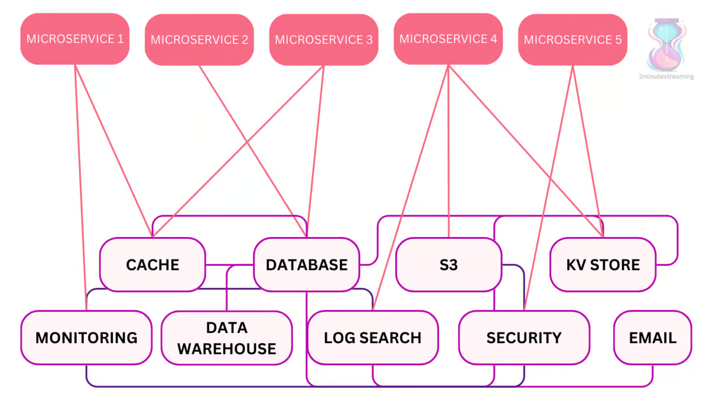

为了解决服务与服务之间、以及各种持久化存储相互组合所带来的复杂度爆炸，他们决定开发一个统一的平台，作为唯一可信数据源（source of truth）。

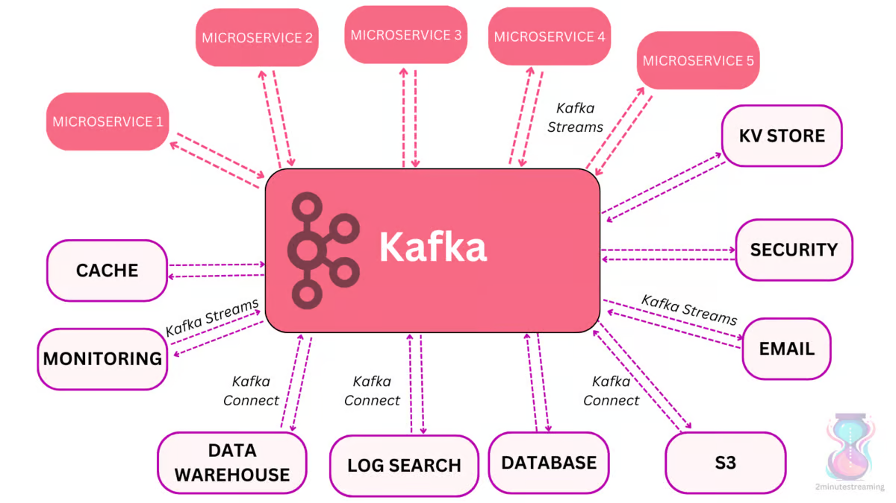

Apache Kafka 是一个旨在解决服务协调问题的分布式系统。它的愿景是充当企业内部的“中枢神经系统”——数据在这里汇聚、被处理与转换，再被下游系统（数据仓库、索引、微服务等）消费。

因此，它在设计上就针对“高吞吐（每秒数百万条消息）+ 大数据量存储（TB 级）”做了优化。

## 日志（The Log）

系统中的数据存储在**主题（topic）**里。而主题的底层基础是**日志（log）**——一种简单的有序数据结构，按顺序依次存储记录。

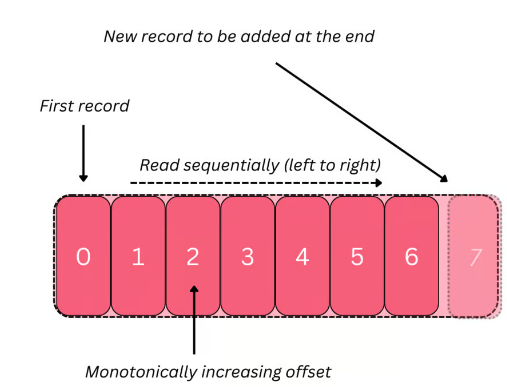

日志支撑起了 Kafka 的许多核心特性，因此值得我们多花些篇幅来理解它。

日志是**不可变的**，并且（只要是从头部或尾部进行）读写都是 O(1) 的。因此，无论日志变得多大，访问数据的速度都不会下降；而由于其不可变性，它对并发读取也非常高效。

但撇开这些优点不谈，日志最关键的好处、也许也是 Kafka 选择它的首要原因，在于它对机械硬盘（HDD）极其友好。

HDD 在**线性**读写上效率很高，而日志的结构决定了——你对它执行的主要操作恰恰就是线性读写！

正如我们在 [S3 那篇文章](https://highscalability.com/behind-aws-s3s-massive-scale/)中讲过的，自问世以来，HDD 每字节的成本（经通胀调整后）已经便宜了 60 亿倍。Kafka 的架构，正是为“在本地部署（on-premise）中以低成本存储海量数据、同时保持高性能”这一目标而优化的！

## 性能（Performance）

一个优化良好的本地 Kafka 部署，最终的瓶颈通常落在**网络**上——换句话说，它的读写吞吐能扩展到每秒数 GB。

它是如何做到如此高性能的？这背后有多种优化——有些是宏观层面的，有些是微观层面的。

### 持久化到磁盘

Kafka 实际上会把所有记录都存到磁盘上，而不会显式地在内存中保留任何数据。

Kafka 的协议会把消息**批量打包**。这使得网络请求可以将多条消息聚合在一起，从而**降低网络开销**。

服务端则会一次性把一整批消息持久化下来——这是一次线性的 HDD 写入。消费者随后也会一次性拉取大块的、连续的数据。

磁盘上的线性读写其实可以很快。人们常说 HDD 慢，那是因为当你进行大量磁盘寻道（seek）时它确实慢——此时瓶颈在于磁头移动到新位置的物理运动。而对于线性读写来说，这不成问题，因为你是随着磁头的移动连续地读写数据。

更进一步说，这些线性操作还被操作系统大幅优化过。

**预读（read-ahead）优化**会在数据被请求之前，就预先取出成倍的大块数据并存入内存，这样下一次读取就无需再触碰磁盘。

**回写（write-behind）优化**会把多次小的逻辑写入合并成一次大的物理写入——Kafka 并不使用 fsync，它的写入是异步刷盘的。

### 页缓存（Pagecache）

现代操作系统会用空闲内存来缓存磁盘内容，这被称为页缓存（pagecache）。

由于 Kafka 在整个流转过程中（生产者 ➡ broker ➡ 消费者）都以一种标准化的二进制格式存储消息、且中途不做任何修改，它得以利用**零拷贝（zero-copy）优化**。

零拷贝这个名字其实有点误导人。它指的是操作系统直接把数据从页缓存拷贝到 socket，从而完全绕过 Kafka 的 JVM。数据其实仍然发生了拷贝——只是拷贝次数减少了。这为你省下了几次额外的数据拷贝，以及若干次用户态 <-> 内核态的切换。

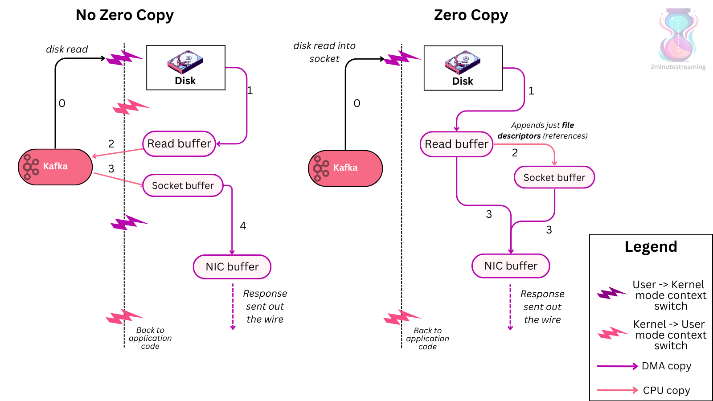

虽然听起来很酷，但零拷贝其实不太可能在 Kafka 的优化中扮演重要角色，主要有两个原因。其一，在优化良好的 Kafka 部署中，CPU 很少成为瓶颈，因此减少内存拷贝并不能为你省下多少资源。

其二，加密与 SSL/TLS（对所有生产环境部署来说都是必需的）会在消息传输途中对其进行修改，这本身就已经让 Kafka 无法使用零拷贝了。即便如此，Kafka 依然性能出色。

## 回归基础（Back to Basics）

这个分布式系统中的节点被称为 **broker（代理）**。

每个主题都会被切分成若干**分区（partition）**，而每个分区本身又会（按照副本因子 replication factor）被复制 N 份，形成 N 个**副本（replica）**，以保证持久性与可用性。

打个简单的比方：就像操作系统里最基本的存储单元是文件一样，Kafka 里最基本的存储单元是（某个分区的）一个副本。

每个副本本身也不过就是若干个文件，每个文件都体现了前面所说的日志数据结构，它们顺序拼接起来构成一个更大的日志。日志中的每一条记录都由一个特定的**偏移量（offset）**来标识，而偏移量其实就是一个单调递增的数字。

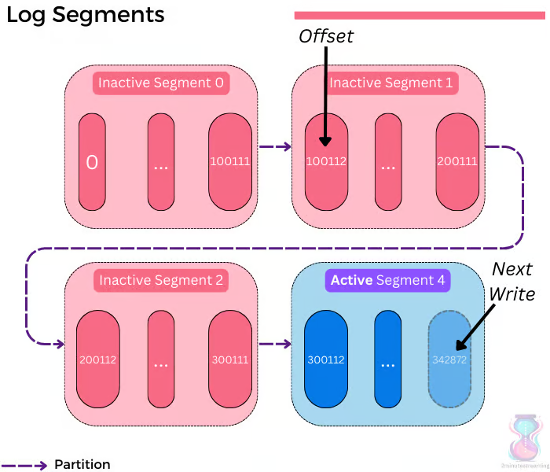

复制机制是**基于 leader（主副本）**的，也就是说，在任一时刻，某个分区只会由一个 broker 来担任其 leader。

每个分区都有一组副本（称为“副本集，replica set”）。副本可以处于两种状态之一——**同步（in-sync）**或**不同步（out-of-sync）**。顾名思义，不同步的副本就是那些没有该分区最新数据的副本。

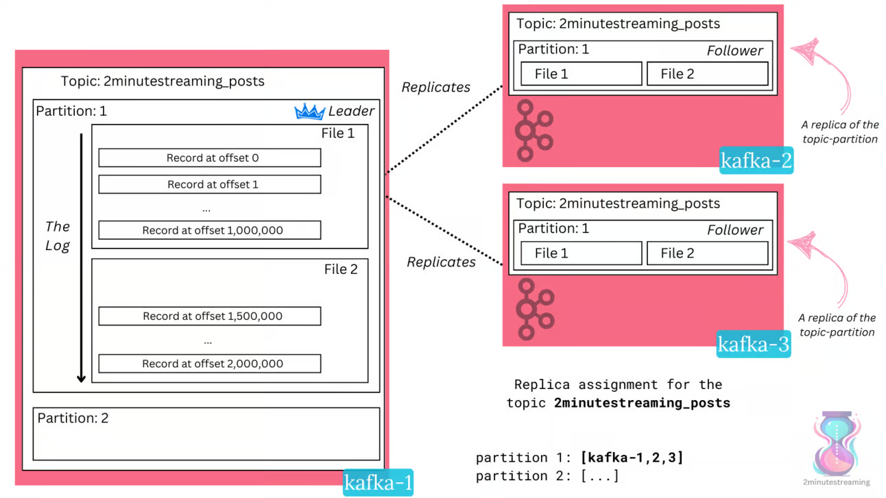

### 写入（Writes）

写入只能发送给 leader，随后由它异步地把数据复制给其余 N-1 个**追随者（follower）**。

写入数据的客户端被称为**生产者（producer）**。生产者可以通过 `acks` 属性来配置写入时希望获得的持久性保证——它表示在把响应返回给客户端之前，需要有多少个 broker 确认（acknowledge）这次写入。

- **acks=0**——生产者根本不会等待 broker 的响应，它会立即认为写入成功。
- **acks=1**——当 leader 确认了该记录（即持久化到磁盘）后，就会向生产者返回响应。
- **acks=all（默认值）**——只有当**所有同步副本（in-sync replicas）**都持久化了该记录后，才会向生产者返回响应。

为了进一步约束 acks=all 的行为、避免在只剩一个同步副本时退化成 acks=1，Kafka 提供了 `min.insync.replicas` 这个配置，用来指定：对于配置了 `acks=all` 的写入，至少需要多少个同步副本确认才算成功。

### 读取（Reads）

读取数据的客户端被称为**消费者（consumer）**。同样地，它们也是使用 Kafka 客户端库、从 Kafka 中读取数据并对其做一些处理的应用程序。

Kafka 的消费者能够从**任意副本**读取数据，并且通常会被配置为从网络拓扑中最近的那个副本读取。

消费者会组成所谓的**消费者组（consumer group）**，也就是一组在逻辑上被归到一起、彼此协同的消费者。它们通过与 broker 通信来相互协调——彼此之间并没有直接连接。它们会把自己的消费进度（即在每个分区上消费到了哪个偏移量）持久化到一个特殊的 Kafka 主题 `__consumer_offsets` 的某个分区中。担任该分区 leader 的那个 broker，会充当这个消费者组的所谓**组协调者（Group Coordinator）**；正是这个协调者负责维护消费者组的成员关系与存活状态。

任何单个分区内部的记录都是有序的，消费者也能保证按正确的顺序读取它们。为了保持这种顺序，消费者组协议确保：同一个消费者组内，不会有两个消费者同时读取同一个分区。

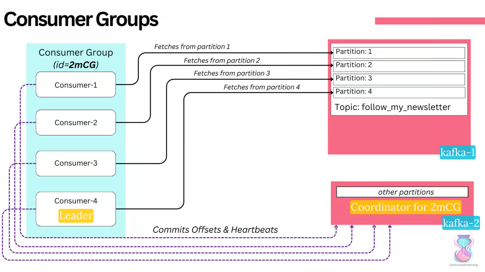

同一个主题可以被许多个不同的消费者组同时读取。

Kafka 之所以能战胜传统的消息总线技术，一个核心原因恰恰就在于它对生产者与消费者客户端的这种**解耦**。在某些系统里，消息一旦被消费就会立即删除，这就造成了耦合：如果消费者速度慢，系统就可能面临内存耗尽的风险，进而影响到生产者。Kafka 不存在这个问题，因为它把数据持久化到了磁盘，而且得益于前面提到的种种优化，它依然能保持高性能。

### 协议（Protocol）

客户端通过 TCP、使用 Kafka 协议与 broker 建立连接。

生产者/消费者客户端其实就是实现了 Kafka 协议的简单 Java 库。而几乎所有其他主流语言，也都有对应的实现。

## 容错（Fault Tolerance）

一个 Apache Kafka 集群中，始终会有一个 broker 担任集群当前活跃的**控制器（Controller）**。控制器负责支撑各种需要“单一可信源”的管理操作，比如创建和删除主题、给主题增加分区、重新分配分区副本等。

它最具影响力的职责，是处理每个分区的 **leader 选举**。由于集群所有集中式的元数据都由控制器来处理，因此是由它来决定：某个分区的 leader 何时、切换到哪个 broker。这一点在故障切换（failover）场景中体现得最为明显——比如某个 leader broker 挂掉，甚至只是正常关闭时。在这两种情况下，控制器都会做出反应，优雅地把该分区的 leader 切换到副本集中的另一个 broker。

## 共识（Consensus）

任何分布式系统都需要**共识（consensus）**——在任一时刻恰好选出一个 broker 来担任控制器，本质上就是一个分布式共识问题。

从历史上看，Kafka 把共识这件事外包给了 ZooKeeper。集群启动时，每个 broker 都会争相去注册 `/controller` 这个 zNode，第一个成功注册的就会被“加冕”为控制器。同样地，当现任控制器挂掉后，下一个抢先注册该 zNode 的 broker 就会成为新的控制器。

Kafka 过去还会把各种元数据都持久化在 ZooKeeper 中，包括存活的 broker 集合、主题名称及其分区数量，以及分区的分配情况。

Kafka 过去也大量依赖 ZooKeeper 的 **watch（监听）机制**——每当某个 zNode 发生变化时，它就会通知订阅了该节点的一方。

最近几年，Kafka 一直在积极地摆脱对 ZooKeeper 的依赖，转向自己的共识机制——**KRaft（“Kafka Raft”）**。

KRaft 是 Raft 的一种“方言”，与标准 Raft 有些许差异，并深受 Kafka 既有复制协议的影响。最简单地说，它就是在 Kafka 复制协议的基础上，扩展了一些与 Raft 相关的特性。

一个关键的洞见是：集群的元数据完全可以用一个普通的日志来表达——即把集群中发生的事件按顺序记录下来。这样，broker 只需**重放（replay）**这些事件，就能构建出系统的最新状态。

在这套新模型中，Kafka 拥有一个由 N 个控制器（通常是 3 个）组成的**法定人数集合（quorum）**。这些 broker 承载着一个特殊的主题，称为**元数据主题**（`__cluster_metadata`）。

这个主题只有一个分区，而它的 leader 选举是由 Raft 来管理的（不像其他所有主题那样由控制器来负责）。该分区的 leader 就成为当前活跃的控制器，其余的控制器则充当**热备（hot standby）**，在内存中保存着最新的元数据。

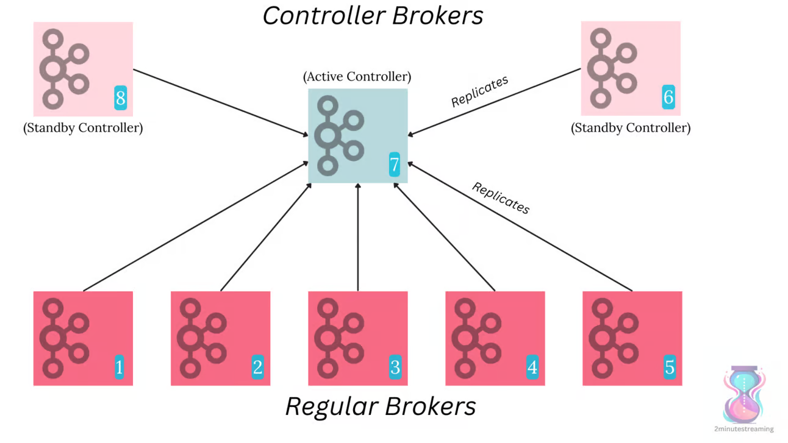

所有普通的 broker 也都会复制这个主题。这样一来，它们无需再直接与控制器通信，只需持续跟进该主题的最新记录，就能异步地更新自己的元数据。

KRaft 支持两种部署模式——**混合模式（combined）**与**隔离模式（isolated）**。混合模式类似于 ZooKeeper 时代的模型，一个 broker 可以同时兼任普通 broker 和控制器两个角色。隔离模式则是让控制器只作为控制器来部署，除此之外不承担任何其他职能。

首个带有生产可用 KRaft 版本的 Kafka 发行版是 **Kafka 3.3**，于 2022 年 10 月发布。ZooKeeper 则计划在下一个大版本——**4.0**（预计在 2024 年第三季度左右）中被彻底移除。

## 分层存储（Tiered Storage）

如前所述，Kafka 的架构最初是为“低成本的本地部署”而优化的。然而在那之后，云的普及无疑已经改变了我们构建软件的方式。

随着 Kafka 的流行，有一个架构选择变得越来越不合时宜，那就是它把**存储与 broker 绑定在一起**的决定。broker 会把所有数据都存放在自己的本地磁盘上，这带来了一些挑战，在大规模场景下尤为突出。

首先，由于 Kafka 被定位为企业架构的中枢神经系统，人们常常希望每个 broker 上能存储 3TB 的历史数据——按默认的副本因子 3 来算，这意味着总共 9TB 的数据。

当一个 broker 本地存有接近 10TB 的数据时，一旦出现故障，问题就开始显现了。

一个显而易见的问题是**非优雅关闭（ungraceful shutdown）**的处理——当一个 broker 从非优雅关闭中恢复时，它必须重建与其分区相关的所有本地日志索引文件，这个过程称为**日志恢复（log recovery）**。对于一块 10TB 的磁盘来说，这在某些情况下可能耗时数小时，乃至数天。

另一个问题是**历史数据读取**。Kafka 的高性能在很大程度上依赖于一个假设：消费者读取的是日志的尾部——在实践中，这意味着由于页缓存里存有最新生产的数据，它们其实是在从内存读取。可一旦某个消费者去拉取历史数据，通常就会迫使 Kafka broker 从 HDD 上读取。而 HDD [长期以来一直卡在 120 IOPS](https://highscalability.com/behind-aws-s3s-massive-scale/) 左右，也就是说，这点资源非常容易被耗尽。这意味着消费者会与生产者争抢 IOPS，一旦 IOPS 被榨干，性能就会急剧下滑。

在**硬故障（hard failure）**场景下，IOPS 问题会被进一步放大。如果某个 broker 的磁盘发生硬故障，它启动时磁盘是空的，必须从头把那 10TB 数据全部复制一遍。视可用带宽而定，这个过程本身就可能耗时长达一天；而在此期间，这个 broker 会向许多其他 broker 发起大量历史读取。一次这样的故障，就会放大成海量的历史读取——如果是整个可用区（availability zone）发生硬故障，影响还会严重得多。

数据量带来麻烦的最后一种场景，是**再平衡（rebalancing）**。Kafka 允许你重新分配任意分区的副本——而这会连带着把该分区的全部数据也一起搬迁。

举个简单的例子：假设某个分区的副本集是 broker [0, 1, 2]。通常第一个副本就是 leader，因此是 broker 0 在担任该分区的 leader。如果你想引入新的副本，它们一开始会是不同步副本，必须先从 leader（broker 0）那里读取该分区的全部数据，之后才能成为同步副本。

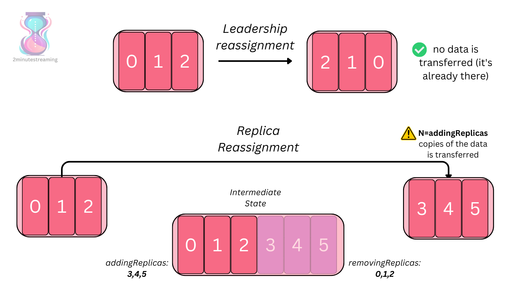

举例来说，如果你往 Kafka 集群里新增了一些节点，就必须把一部分分区副本重新分配到这些新 broker 上，否则它们就会一直空着。而重新分配的过程需要接收方 broker 复制相应副本的全部数据——由于这属于历史读取，它不仅本身就会耗费宝贵的 IOPS，还会花费很长时间。

Apache Kafka 正在通过引入一个名为[分层存储（Tiered Storage）](https://2minutestreaming.beehiiv.com/p/apache-kafka-kip-405-tiered-storage)的特性来解决所有这些问题——其思路很简单：把大部分数据存放到远程对象存储（例如 S3）中。尽管目前仍处于早期访问（Early Access）阶段，Kafka 现在已经拥有了两层存储——**热的本地存储**与**冷的远程存储**——并且两者都被无缝地抽象了起来。

在这套新模式下，由 leader broker 负责把数据分层（tier）到对象存储中。一旦完成分层，leader 和 follower broker 都可以从对象存储读取数据，以对外提供历史数据。

这个特性漂亮地解决了前面提到的所有问题：broker 不再需要复制海量数据，历史读取也不再会耗尽 IOPS。开发阶段的测试表明，在存在历史消费者的情况下，生产者性能提升了 **43%**。视所用的对象存储而定，这还可能带来成本上的节省，因为你把复制与持久性保证都外包出去了。

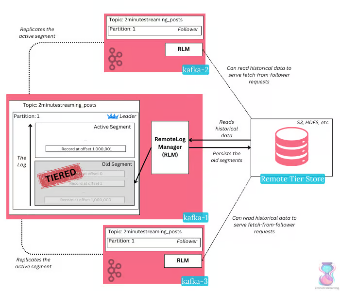

## 辅助系统（Auxiliary Systems）

### 再平衡（Rebalancing）

在任何有一定使用量的 Kafka 集群里，重新分配分区都是一项关键的必备操作。

由于它是一个客户端负载各不相同的分布式系统，在其整个生命周期中，系统很容易出现热点（hot spot）或资源分布不均的情况。

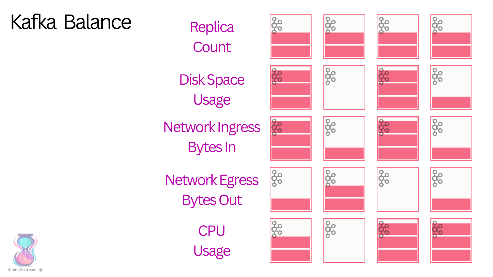

为了缓解这个问题，Kafka 暴露了一个底层 API，允许你重新分配分区。不过，把这个功能暴露出来只是容易的部分——难的部分在于决定“把什么搬到哪里”。

这本质上就是一个 [NP 难的装箱问题（Bin Packing problem）](https://en.wikipedia.org/wiki/Bin_packing_problem)。为此，社区开发了若干工具，甚至还有一个功能完备的独立组件来处理它。

[Cruise Control](https://github.com/linkedin/cruise-control) 同样最初诞生于 LinkedIn，是一个开源组件。它会从一个 Kafka 主题中读取所有 broker 的指标，在内存中构建出集群的模型，然后用一个贪心的启发式装箱算法来运行这个模型，通过重新分配分区来对其进行优化。一旦它计算出了一个更高效的模型，就会借助前面提到的 Kafka 底层重分配 API，把这个模型增量地应用到集群上。

不深入太多细节的话，Cruise Control 对外提供了一套可配置的再平衡逻辑，它由多个 `Goal`（目标）组成，每个 Goal 都会按其对应的优先级运行，并针对其对应的资源进行均衡。

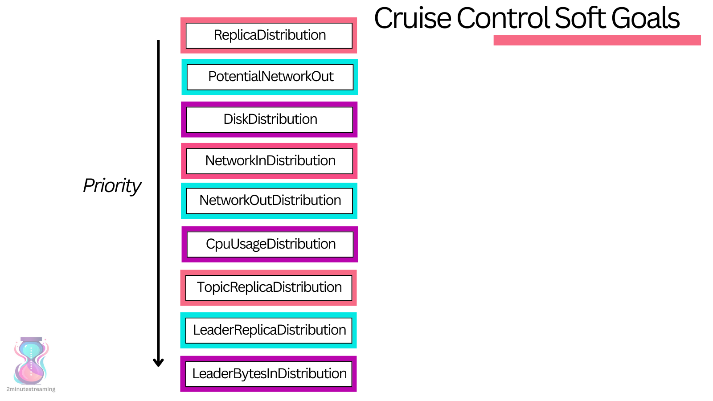

Cruise Control 会持续监控集群的指标，一旦发现指标超出了它所定义的可接受阈值，就会自动触发一次再平衡。

值得一提的是，Cruise Control 还提供了 API，让你可以轻松地向集群添加 broker 或从集群移除 broker。由于 Kafka 的 broker 是有状态的（即便用了分层存储也是如此），这两种操作都需要运维人员来回搬迁副本。

### Kafka Connect

如果 Kafka 要成为你事件驱动架构的中心，那么你很可能会：

- 有很多系统，你希望把它们的数据导**入** Kafka（这类系统称为源，source）；
- 有很多系统，你希望把数据**从** Kafka 导入到它们当中（这类系统称为汇，sink）。

这些系统里，很可能有不少都是热门且被广泛采用的——比如 ElasticSearch、Snowflake、PostgreSQL、BigQuery、MySQL 等等。

Kafka Connect 是 Apache 开源项目的一部分，它是一个通用框架，让你能够以一种即插即用、且可被社区复用的方式，把 Kafka 与其他系统集成起来。

Kafka Connect 运行时可以以两种模式部署：

- **单机模式（Standalone Mode）**——单个节点，主要用于开发、测试或小规模的数据加载。
- **分布式模式（Distributed Mode）**——由一组节点组成的集群，它们协同工作，分担数据摄取的负载。

Connect 中的每个节点都称为一个 **Connect Worker（工作节点）**。一个 worker 本质上就是一个执行插件代码的容器。

社区成员开发了大量久经考验的插件，它们保证了容错、精确一次处理（exactly-once processing）、有序性等各种约束——而这些若要从零开始自行开发，会既繁琐又耗时。这样一个插件就被称为**连接器（Connector）**——一个开箱即用的库，部署在 Connect Worker 上，用于把数据导入 Kafka 主题，或从中导出到其他外部系统。

worker 会大量利用 Kafka 内部主题来存储它们的配置、状态，并对自己的进度（偏移量）做检查点（checkpoint）。

它们还会借助 Kafka 既有的消费者组协议，来处理 worker 故障以及分发任务分配。

用户把插件安装到 worker 上，并通过一个 REST API 来配置/管理它们。这样一个称为**连接器（Connector）**的插件，可以很方便地被部署和配置，从而把 Kafka（某个 Kafka 主题）与外部系统连接起来。

连接器的代码处理了数据交换过程中的所有复杂细节，从而让用户可以专注于简单的配置与集成。这些代码会为每个 worker 创建任务，以并行地搬运数据。连接器分为两种类型：

- **源连接器（Source Connector）**——用于从另一个系统（源）获取数据并写入 Kafka。
- **汇连接器（Sink Connector）**——用于从 Kafka 获取数据并写入到另一个系统（汇）。

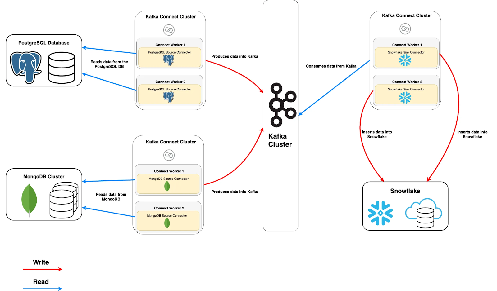

在上图中，我们可以看到两个源连接器分别运行在两个独立的 Connect 集群里，各自拥有自己的 worker，把 MongoDB / PostgreSQL 的数据摄取到 Kafka 中。

而另一个独立的、运行着汇连接器的 Connect 集群，则从 Kafka 中取出这些数据，再把它们摄取到 Snowflake。

### Kafka Streams

所谓**流处理器（stream processor）**，通常是这样一个客户端：它从输入主题读取连续不断的数据流，对这些输入做一些处理，再把处理后的数据流生产到输出主题（或外部服务、数据库等）。在 Kafka 中，你可以直接用普通的生产者/消费者 API 来完成简单的处理；但对于更复杂的转换——比如把多个流连接（join）起来——Kafka 则提供了一个集成的 Streams API 库。

Kafka Streams 同样是 Apache 开源项目的一部分，它是一个客户端库，对外提供了一套高层 API，用于实时地处理、转换和丰富数据。

这套 API 的设计初衷就是在你自己的代码库中使用——它并不运行在 broker 上。与其他流处理框架不同，它是 Kafka 原生的，因此无需一套独立而复杂的部署方案——它就作为一个普通的 Kafka 客户端来部署，通常就嵌在你的应用程序里。

它的工作方式与消费者 API 类似，能帮助你把流处理工作横向扩展到多个应用实例上（其原理类似于消费者组）。

最值得一提的是，当它的输入和输出都是 Kafka 主题时，它支持精确一次**处理（processing）**语义。

## 优化与未来展望（Optimizations / Future Work）

尽管 Kafka 看起来像是一个“老”软件（它早在 2011 年就首次发布了！），社区却一直在这套协议之上积极地创新。

就目前来看，种种迹象表明，未来的格局将会是：大家都统一到 Kafka 的 API 标准之上，转而在底层实现上展开竞争。

当前这一领域的领跑者是 **Confluent**——它由 Kafka 最初的创造者们创立，并开发了一个[名为 Kora 的云原生 Kafka 引擎](https://www.vldb.org/pvldb/vol16/p3822-povzner.pdf)。

值得关注的竞争者包括 [RedPanda](https://www.youtube.com/watch?v=FEVL8cLUFOc)——它用 C++ 重写了 Kafka；以及 [WarpStream](https://docs.warpstream.com/warpstream/overview/architecture)——它以一套大量借助 S3 的全新架构进行创新，彻底摒弃了复制和 broker 的有状态性。

如今，各家厂商主要在云上展开竞争——许多厂商都提供了支持程度不一的 Kafka SaaS 服务。有些厂商通过把大量细节抽象掉，提供了真正的无服务器（serverless）SaaS 体验；而另一些则仍然要求用户理解系统的种种细节，某些情况下甚至还得自己管理其中很大一部分。

总而言之，Kafka 是一款成熟且被广泛采用的软件，提供了一套丰富的特性。

它是开源的，并且拥有一个非常健康的社区——在历经 13 年的发展之后，这个社区的创新势头比以往任何时候都更加强劲。
